  

   
  
  

  <h3>Press START ➜ Level up code, catch new skills, ship rare drops</h3>

  <a href="#trainer-card">Trainer Card</a> •
  <a href="#quest-log">Quest Log</a> •
  <a href="#pokedex-projects">Pokédex (Projects)</a> •
  <a href="#skills">Skills</a> •
  <a href="#stats">Stats</a> •
  <a href="#achievements">Achievements</a> •
  <a href="#activity">Activity</a> •
  <a href="#contact">Contact</a>

  

  

### Trainer Card

  

### Quest Log

  

### Pokédex (Projects)

  
  
  
   
  
  
  

  
Project links

  - **Agriculture_MIC**: Intelligent crop insights, alerts, and analytics
    - Repo: [`AsukaFurukawa/Agriculture_MIC`](https://github.com/AsukaFurukawa/Agriculture_MIC)
  - **AI-Driven Structural Health (Drone Imagery)**: Vision models for damage detection
    - Repo: [`AsukaFurukawa/AI-Driven-Structural-Health-Monitoring-Using-Simulated-Drone-Imagery`](https://github.com/AsukaFurukawa/AI-Driven-Structural-Health-Monitoring-Using-Simulated-Drone-Imagery)
  - **BigData-Sentiment-Analysis**: Scalable sentiment pipelines and dashboards
    - Repo: [`AsukaFurukawa/BigData-Sentiment-Analysis`](https://github.com/AsukaFurukawa/BigData-Sentiment-Analysis)
  - **OmniOrchestrator**: Automations and multi-tool workflows
    - Repo: [`AsukaFurukawa/OmniOrchestrator`](https://github.com/AsukaFurukawa/OmniOrchestrator)
  - **MyBlog**: Typed developer blog and notes
    - Repo: [`AsukaFurukawa/MyBlog`](https://github.com/AsukaFurukawa/MyBlog)
  - **ResearchHub**: Experiments and notebooks
    - Repo: [`AsukaFurukawa/ResearchHub`](https://github.com/AsukaFurukawa/ResearchHub)

### Skills

#### 🧠 Core Programming Languages

  
  
  
  
  
  

#### ⚙️ Frameworks & Tools

  
  <!-- Backend -->
  
  
  
  

   

  <!-- Frontend -->
  
  
  
  

   

  <!-- Databases -->
  
  
  

   

  <!-- Cloud & Big Data -->
  
  
  
  
  
  

   

  <!-- Containers & CI/CD -->
  
  
  
  

#### 🤖 AI/ML & Data Science

  <!-- Libraries -->
  
  
  
  
  
  
  

- Expertise: NLP (Transformers, Hugging Face), Computer Vision, Anomaly Detection, Online Learning
- Projects: Vehicle Detection & Forecasting, Threat Intelligence Automation, PINN‑based Rocket Simulation, Sentiment Analysis Engine

#### 🌐 APIs, Microservices & Integrations

- REST APIs with NestJS / FastAPI
- WebSocket & LiveKit real‑time integration
- Redis caching, Kafka event streaming
- JWT and OAuth authentication

#### 🚀 DevOps & Testing

  
  
  
  
  

### Stats

  
  
   
  

### GitHub Metrics

  

  
📊 Detailed Metrics

   
  
   
  
  
   
  
  

### Achievements

  

### Activity Graph

  

### Contribution Snake

  <picture>
    <source media="(prefers-color-scheme: dark)" srcset="https://raw.githubusercontent.com/AsukaFurukawa/AsukaFurukawa/output/github-contribution-grid-snake-dark.svg" />
    
  </picture>

### Contact

- **Let's co-op**: Open an issue on this repo or DM on GitHub.
- **Press START**: Star a project and say hi!

  
   
  Made with ❤️ + 16‑bit vibes. Art assets are original and free to use with attribution.

